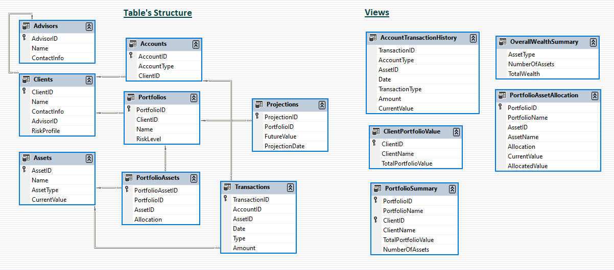
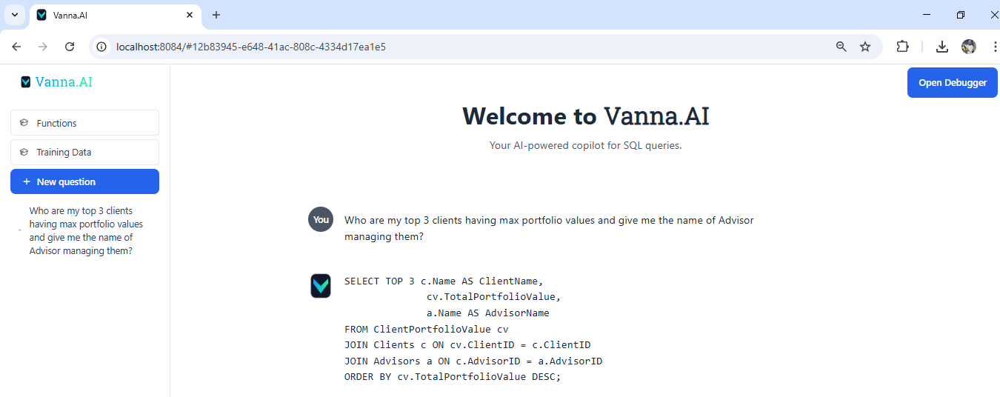

## Financial Reporting using Text To SQL in Vanna AI
#### This project enables financial reporting and analysis using natural language queries through Vanna AI's Text-to-SQL capabilities. 
#### By integrating with a SQL database and leveraging RAG-based training artifacts, users can intuitively access insights on portfolio performance, asset allocation, and transaction histories.

## 📊 Project Description

Through the integration of text-to-SQL capabilities powered by Vanna AI, users can perform financial queries using simple natural language, making data analysis more intuitive and accessible even for non-technical users. An interactive reporting dashboard further enhances the experience by offering real-time analytics and visualizations of:

- Portfolio performance  
- Asset distribution  
- Transaction histories  
- Projections

## 📂 Project Structure
~~~
VannaAIFinancialReporting/
│ Config.py
│ InsertToSQL.py
│ readme.md
│ requirements.txt
│ TrainVanna.py
│ VisualizeSQLRAG.py
│
├───Resources
|     AppDemo.gif
│     AppVisualization.pdf
│     Data_Description.png
│
├───SQL/
│ ├── create_tables.sql
│ ├── create_views_sql.sql
│ └── stored_procedures.sql
│
├───TrainingRAG-Artifact/
│ ├── Documentation.txt
│ ├── Proc.json
│ ├── Tables.json
│ └── Views.json
~~~

## 🧾 Data Description

 

The dataset includes comprehensive financial information crucial for wealth management:

- **Wealth Assets Data**: Details of client portfolios, including asset classes such as stocks, bonds, real estate, and alternative investments.  
- **Financial Records**: Transaction histories and investment portfolios for a complete financial overview.

## ⚙️ Tech Stack

- **Language**: Python 3.13.2  
- **Libraries**: `pyodbc`, `faker`, `pandas`, `Vanna AI`  
- **Dashboard Framework**: `Vanna AI (Flask App)`
---

## 🚀 Approach

### 1. Requirements
Install dependencies using:

```pip install -r requirements.txt```

### 2. Data Generation

1. Get your Vanna AI model and keys from: [https://vanna.ai/account/profile](https://vanna.ai/account/profile)  
2. Get your SQL server details and create a database. Ensure it is accessible from Vanna AI. Test connection via the Vanna dashboard.  
3. Update your `Config.py` with Vanna credentials and SQL connection details. Here is the required information
```
    Vanna_API_Key = 'Vanna_API_Key' 
    SQLServer = r"SQLServerendpoint"
    UserName = "sqlUserName"
    Password = "sqlPassword"
    Database = "asset-management"
    Vanna_Model_Name = 'Vanna_Model_Name' 
    EmailAddress = '<EmailAddress>'
```
4. Execute schema creation and data generation:  
   - SQL schema (tables, views, procedures) defined in the `SQL` folder  
   - `InsertToSQL.py` creates schema and generates fake data using `faker`  
5. Modify data size as needed in `InsertToSQL.py`  
6. Run the following to generate data:  
   ```python .\InsertToSQL.py```

### 3. Training Vanna AI
Train your Vanna model using schema and contextual artifacts:

1. Refer to the TrainingRAG-Artifact folder containing:
2. `Tables.json`, `Views.json`, `Proc.json` (for schema definition)
3. `Documentation.txt` (contextual design for better training)
4. After training, a `training_summary.csv` will be generated.
5. Run the training code:
    
    ```python .\TrainVanna.py```

### 4. Text-to-SQL using Vanna AI with Natural Language Queries
1. Run following code to see the app on your browser and test your questions:
    
    ```python .\VisualizeSQLRAG.py```

## 👀 App Preview


## 📌 Notes
- Item that starts with a bullet-like dot. Ensure that your SQL server allows remote connections and Vanna AI has access.
- Training artifacts should reflect the latest schema changes for best results.
- Adjust the fake data volume to match your testing requirements.